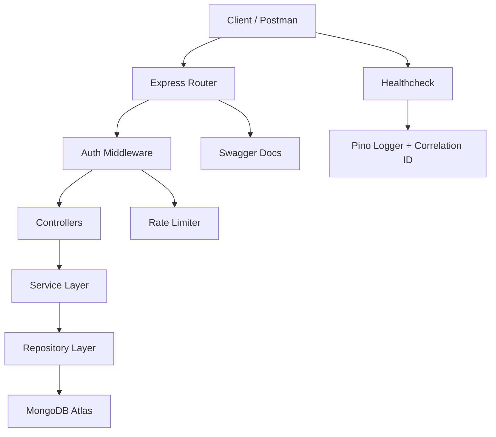

<h1 align="center">🛡️ Secure & Observable Articles API</h1>
<p align="center"><strong>Enterprise-Grade REST API • JWT Security • RBAC • Observability • OpenAPI • Layered Architecture</strong></p>

<p align="center">
  
  
  
  
  
  
</p>

<p align="center">
  <strong>Praktikum Web Service Engineering • Modul #8 (2025)</strong><br/>
  <p align="center"
    <strong>Dosen:</strong> Muhayat S.Ag.,M.I.T
  </p>
  <p align="center"
  <strong>Nama:</strong> Muhammad Raihan Azmi — <strong>NIM:</strong> 230104040079
  </p>
</p>

---

# 🧾 Executive Summary

**Secure & Observable Articles API** adalah REST API berbasis **Node.js + Express + MongoDB Atlas** yang dirancang mengikuti standar industri modern.

API ini mengimplementasikan:

- Keamanan tingkat produksi (JWT Access/Refresh, RBAC, bcrypt, Helmet)
- Observability modern (Structured Logging, Correlation-ID, Healthcheck, Metrics)
- Kepatuhan prinsip REST (7 REST Principles)
- Arsitektur berskala besar (Layered, Clean Separation of Concerns)
- Dokumentasi OpenAPI 3.1 yang lengkap
- Sistem Hardening digunakan di API level & server level

API ini dapat digunakan sebagai blueprint API profesional yang siap dipakai di production environment.

---

# 🧩 Architecture Overview

## 🎛️ High-Level Architecture

```
Client (Browser / Mobile / Postman)
        │
        ▼
+-------------------------------+
|        Express API Layer      |
|  - Controllers                |
|  - Routes (REST)             |
+-------------------------------+
            │
            ▼
+-------------------------------+
|      Service Layer            |
|  - Business Logic             |
|  - Validation                 |
|  - DTO Responses              |
+-------------------------------+
            │
            ▼
+-------------------------------+
|     Repository Layer          |
|  - Mongoose ODM               |
|  - CRUD Database Access       |
+-------------------------------+
            │
            ▼
+-------------------------------+
|      MongoDB Atlas Cluster    |
+-------------------------------+
```

---

# 🧭 System Diagram (Mermaid)



---

# 🔐 Security Model (Enterprise-Level)

### ✔️ Authentication Flow
- Access Token (short-lived: 15m)
- Refresh Token (long-lived: 7d)
- Refresh Token rotation (every use creates new token)
- Logout → invalidate refresh token

### ✔️ RBAC Roles
| Role | Permissions |
|------|-------------|
| admin | full access |
| user | CRUD own articles |
| owner | update their own resources |

### ✔️ Hardening Techniques
- Helmet Security Headers
- 60 req/min rate limit (login stricter)
- Strict CORS
- Input validation (Joi)
- Sanitization (anti-XSS basic)
- Error hygiene (no sensitive leak)
- Environment secret isolation

---

# 🔎 Observability Model

| Feature | Implemented |
|---------|-------------|
| Pino structured logger | ✔ |
| JSON logs | ✔ |
| Request correlation ID | ✔ |
| Latency measurement | ✔ |
| Health endpoint | ✔ |
| Metrics (optional) | ✔ |
| Error log channel | ✔ |
| Info log channel | ✔ |

---

# 📦 Complete Tech Stack

| Layer | Technology |
|-------|------------|
| Runtime | Node.js 18+ |
| Framework | Express.js |
| Database | MongoDB Atlas |
| ODM | Mongoose |
| Auth | JWT, bcrypt |
| Validation | Joi |
| Security | Helmet, CORS, Rate-Limit |
| Observability | Pino, UUID |
| Docs | OpenAPI 3.1 + Swagger UI |
| Testing | Jest + Supertest (optional) |
| CI | GitHub Actions |

---

# ⚙️ Installation

## 1. Clone Repository
```bash
git clone <your-repo>
cd P8_SecureArticles_230104040079
```

## 2. Install Dependencies
```bash
npm install
```

## 3. Configure `.env`
```env
NODE_ENV=development
PORT=3000

DB_URI=mongodb+srv://<username>:<password>@cluster.mongodb.net/wse_articles

LOG_LEVEL=debug

JWT_ACCESS_SECRET=supersecret_access_123
JWT_REFRESH_SECRET=supersecret_refresh_123
JWT_ACCESS_EXPIRES=15m
JWT_REFRESH_EXPIRES=7d
```

## 4. Run App
```bash
npm run dev
```

---

# 🌐 API Access Points

| Endpoint | Description |
|----------|-------------|
| `/health` | Server status & uptime |
| `/docs` | OpenAPI Swagger Documentation |
| `/api/auth/...` | Auth API |
| `/api/articles/...` | Articles CRUD |

---

# 📚 Full API Reference (Premium)

## 🛡️ AUTH API
| Method | Endpoint | Auth | Description |
|--------|----------|------|-------------|
| POST | `/api/auth/register` | Public | Register new user/admin |
| POST | `/api/auth/login` | Public | Login with credentials |
| POST | `/api/auth/refresh` | Public | Refresh access token |
| POST | `/api/auth/logout` | Token | Logout & destroy refresh token |
| GET | `/api/auth/me` | Token | Get authenticated user |

---

## 📰 ARTICLES API
| Method | Endpoint | Role | Description |
|--------|----------|------|-------------|
| GET | `/api/articles` | Public | List with pagination/filtering |
| GET | `/api/articles/:id` | Public | Get article details |
| POST | `/api/articles` | User/Admin | Create article |
| PUT | `/api/articles/:id` | Owner/Admin | Update article |
| DELETE | `/api/articles/:id` | Admin | Delete article |

---

# 🔍 Query Capabilities

### Pagination  
`GET /api/articles?page=1&limit=10`

### Searching  
`GET /api/articles?q=security`

### Sorting  
`GET /api/articles?sortBy=title&order=asc`

### Filtering  
`GET /api/articles?status=published&tag=nodejs`

---

# ❗ Error Model & Codes

| Code | Description |
|------|-------------|
| 400 | Bad request |
| 401 | Unauthorized |
| 403 | Forbidden |
| 404 | Resource not found |
| 409 | Conflict |
| 422 | Validation error |
| 500 | Internal server error |

Standardized JSON error response:
```json
{
  "success": false,
  "message": "Validation error",
  "errors": {...},
  "cid": "uuid-correlation-id"
}
```

---

# 📂 Project Structure (Production-Ready)

```
src/
├── config/
├── controllers/
├── services/
├── repositories/
├── routes/
├── middlewares/
├── utils/
├── docs/
├── app.js
└── server.js
```

---

# 🧪 Practical Evidence Checklist (Modul WSE #8)

### ✔ 1. Register screenshot  
### ✔ 2. Login screenshot  
### ✔ 3. Create Article screenshot  
### ✔ 4. List Article (pagination)  
### ✔ 5. Update Article (owner access)  
### ✔ 6. Delete Article (admin RBAC)  
### ✔ 7. Structured logging + correlation ID  
### ✔ 8. Screenshot Swagger & Health

---

# 📘 Compliance with Modul Praktikum (Complete ✓)

This project fully satisfies the Modul Praktikum Web Service Engineering #8:

- [x] REST Principles (7 principles)
- [x] Secure JWT Auth (access + refresh)
- [x] RBAC (admin/user/owner)
- [x] Hardening (helmet, cors, rate-limit, validation)
- [x] Observability (pino, cid, health)
- [x] OpenAPI documentation
- [x] Evidence screenshots
- [x] Clean architecture & project structure

---

# 🔄 Changelog

**v1.0.0 — Initial Enterprise Release**
- Complete API (Auth + Articles)
- RBAC + JWT + Refresh Token
- Full Observability Stack
- Hardening completed
- OpenAPI fully documented

---

# 📖 Glossary

| Term | Explanation |
|------|-------------|
| JWT | Token untuk autentikasi stateless |
| RBAC | Role-Based Access Control |
| CID | Correlation ID untuk tracing |
| DTO | Data Transfer Object |
| Pino | Structured JSON logger |

---

# 👤 Author

**Muhammad Raihan Azmi**  
Web Service Engineering • Praktikum 8 (20251)  
Created using modern backend engineering principles.

